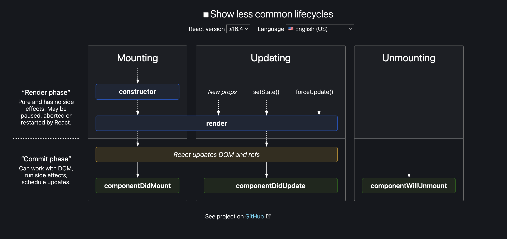

# Namaste React 🚀

1. What is the diff b/w `package.json` & `package-lock.json`?

- `package.json`:
  - configuration file for npm, containing approx version of package installed.
  - Every dependecies has `package.json` in their directory.
- `package-lock.json`: - contains track of exact version of each package installed to avoid any build error in production.
- Both files need to be pushed to github.

2. What are the use cases of `parcel` package?

- Dev build
- Local sever
- HMR (Hot Module Replacement)
- It uses a file watching algorithm (written in C++)
- Faster build (Caching)
- Image Optimization
- Minification
- Compressing
- Content hashing
- Code splitting
- Differetial bundling (To support older browsers)
- Diagnostic
- Error handling
- Allow HTTPs server
- Tree shaking (remove unused code)
- `Note`: When doing prod build using command `npx parcel build index.html` error will pop, because of 1 config: `main: App.js` in `package.json` file. So we need to remove the line.

3. What is a `React Element`?

- Its an object. But when it endered to browser then it converts to html.

4. What is `JSX` ?

- Easier way to write react code for html element.
- Make the developers life easy.
- JSX is not HTML inside Javascript, but HTML/XML like syntax.
- Both will print same object. But since jsx format is more readable so we are going to use it.
  ```
    const heading = React.createElement(
    'h1',
    { id: 'heading' },
    'Namaste React 🚀'
    );
    const jsxHeaing = <h1 id="heading">Namaste React 🚀</h1>;
    console.log(heading);
    console.log(jsxHeaing);
  ```
- Browser can not understand JSX, but behind the scene `babel`(JS compiler) is doing the job.
- `babel` transpile the JSX code to ReactElement before sending to the `js engine`, so that js engine can understand it. `babel` is required by `parcel`.
- JSX => transpiled to React element => JS element => rendered as HTML element
- We have to use `camelCase` while `assigning attributes to JSX`.
- To write JSX in multiple lines we need to wrap it around `()`.
- JSX `sanitize` the data to avoid `cross site scripting`.

5. React Component(2 types)

- class based component(old way)
- functional component(latest standard)
  - normal js function that returns a JSX code/ React element(s).
  - ex:
  ```
    const FunctionalComponent = () => {
      return (some JSX)
    }
  ```
- Components can be used inside other component (Also called component composition)
  ```
    const TitleComponent = () => (
      <h1 id="heading" className="heading" tabIndex={1}>
        Namaste React 🚀 using JSX
      </h1>
    );
    const HeadingComponent = () => (
      <div>
        <TitleComponent /> or {TitleComponent()}
        <h1 id="heading" className="heading" tabIndex={1}>
          Namaste React Functional Component
        </h1>
      </div>
    );
  ```
- Components can be rendered using the syntax `root.render(<HeadingComponent />);`

6. How to put ReactElement inside a ReactComponent & vice versa?

- ```
    const Title =(
      <h1 id="heading" className="heading" tabIndex={1}>
        Namaste React 🚀 using JSX
      </h1>
    );
    const HeadingComponent = () => (
      <div>
        {Title}
        <h1 id="heading" className="heading" tabIndex={1}>
          Namaste React Functional Component
        </h1>
      </div>
    );
  ```
- Same for putting one ReactElement inside another.

7. What is `React Fragment` ?

- Used to wrap multiple html elements with out any div tag.
- Behaves as an empty tag.
- ```
    <React.Fragment>
      <div>Hello</hello>
      <div>I am Satya</hello>
    </React.Fragment>
  ```

- The above can be written like(`<>` is short hand for `<React.Fragment>`)
  ```
    <>
      <div>Hello</hello>
      <div>I am Satya</hello>
    </>
  ```

8. `Config Driven UI`:

- UI is driven by api response.

9. Why we need `key` when iterating ?(very important)

- Each List items/components need to represented uniquely to optimize the rendering cycle.
- When ever we write a map write a key for each item.
- Don't use index as a key.

10. Type of export?

- Default :
  - synatx: export default EXPORT_NAME
  - Used when only 1 export is there
- Named :
  - syntax: export EXPORT_NAME
  - Used when multiple exports are there

11. Why react is fast?

- It can do `efficient DOM manipulation`.

12. What is a `React Hook` ?

- A normal js utility function by react to for state management.
- 2 hooks that are mostly used:

  - `useState()` - Superpowerful state variable

    - syntax:

    ```
      const [restaurantList, functionToUpdateStateVariable] = useState(defaultValue);
    ```

    - ex:

    ```
      import restaurants from '../../restaurants.json';
      import RestaurantCard from './RestaurantCard';
      import { useState } from 'react';

      const Body = () => {
        // Local state variable
        const [restaurantList, setRestaurantList] = useState(restaurants);

        return (
          <div className="body">
            <div className="filter">
              <button
                className="filter-btn"
                onClick={() => {
                  const filteredList = restaurants.filter(
                    (res) => res.data.avgRating > 4
                  );
                  setRestaurantList(filteredList);
                }}
              >
                Top Rated Restaurants
              </button>
            </div>
            <div className="res-container">
              {/* Restaurant Card */}
              {restaurantList.map((restaurant) => (
                <RestaurantCard key={restaurant.data.id} resData={restaurant} />
              ))}
            </div>
          </div>
        );
      };
    ```

    - We can not update function assigned with useState()
    - Whenever any state variable changes react re-render the UI.
    - React refresh the required Component only, not any other components(i.e. if a state variable is in `Header Component` then react will only refresh Hedaer component only).
    - Do not create outside component.

  - `useEffect()` - Call a function when dependencies changed.
    - is a hook which is called after component is rendered.
    - syntax
    ```
      useEffect(() => {
        console.log('call this when dependecy variables changes')
      }, [dependecyVariable])
    ```
    - We can't make call back in useEffect async.
  - Application: (To do API call once page rendered)

  ```
    useEffect(() => {
     // API call
    }, [])
  ```

  - Case1: Empty dependency array => useEffect will be called only once after render.

  ```
  useEffect(() => {function()}, [])
  ```

  - Case2: No dependency array => useEffect will be called everytime after each render.

  ```
  useEffect(() => {function()}, )
  ```

  - Case3: If dependecy array present then callback function will be called once after initial render + everytime after the dependecy value change.

  ```
  useEffect(() => {function()}, [dependecy])
  ```

13. What is `React Fiber`?

- Also known as `Reconciliation Algorithm`. - came up in react 16
- React creates a virtual DOM (represenatation of actual DOM, is a nested object).
- This algo find the diff b/w old & new virtual DOM & optimally update the DOM.
- Read more: https://github.com/acdlite/react-fiber-architecture

14. Shimmer Effect in UI.

- It is used when there is no data.

15. Conditional rendering.

16. Types of Routing:

- Client side:
- Server side:

17. Dynamic Component ?

- Can be acheived using `<Outlet />` it's from `react-router-dom` pkg.
- Childrens are always rendered inside `<Outlet />`

```
  const AppLayout = () => {
    return (
      <div className="app">
        <Header />
        {/* Dynamic Component */}
        <Outlet />
      </div>
    );
  };

  const appRouter = createBrowserRouter([
    {
      path: '/',
      element: <AppLayout />,
      errorElement: <Error />,
      children: [
        {
          path: '/',
          element: <Body />,
        },
        {
          path: '/about',
          element: <About />,
        }
      ]
    }
  ]);

  const root = ReactDOM.createRoot(document.getElementById('root'));

  root.render(<RouterProvider router={appRouter} />);

```

- The children goes to `<Outlet/>` component as per path defined.

18. Dynamic Routing ?

- Can be achived using `{element: <RestaurantMenu />,path: '/restaurant/:resId'}` & assigning to children params.

- resId can be read using ` const { resId } = useParams()`.

19. `formik pkg` is really useful to work with forms.

20. Use `const err = useRouteError()` to get error page information.

21. `<Link>` component internally use `<a>` but it doesnot refresh whole page.

22. Class based component ?

- Need to extends `React.Component`
- Absolute necessary to use `render()` inside the class to use it, it returns some JSX.
- `componentDidMount()` is a function that is called after render & it's the best place to do `API call`.

23. Why we do `super(props)` in class based component?

- In React, super(props) is used in a class component's constructor to call the constructor of the parent class and pass in the props object as an argument.

- The props object contains any data that is passed to the component from its parent component. When you extend a class component in React, you need to call super() in the constructor before you can access this.props. By passing props to super(), you are making sure that the parent class constructor is properly initialized and that you can access the props object in the child component.

- Here is an example of a typical constructor in a React

```
class MyComponent extends React.Component {
  constructor(props) {
    super(props);
    // best pllace to create a state variable
    // This is similar to const [count] = useState(0) in functional component
    this.state = {
      count: 0,
    };
  }
  // component methods here
  render() {
    return (
      <button onClick={() => {
        this.setState({ count: this.state.count + 1 });
      }}>
    )
  }
}
```

- By calling super(props), we ensure that the parent class constructor is properly initialized and that this.props is accessible in the child component. This is necessary because React relies heavily on the props object to pass data between components in a React application.

24. `React Lifecycle`?

- 
- During rendering there are 2 phases:
  - `render phase`: It includes constructor() & render()
  - `commit phase`: Works with DOM, run side effects, schedule updates.

25. Why we can't make the callback function inside `useEffect()` as async ?

- The reason you can't make the callback function in useEffect async is that useEffect expects its callback function to either return a cleanup function or nothing at all.

- When you mark a function as async, it will always return a promise. However, useEffect is not designed to handle promises returned by its callback function.

- If you make the useEffect callback function async, you may encounter unexpected behavior and bugs in your code. This is because useEffect may not wait for the promise to resolve before running the cleanup function or running the effect again.

- For example, if you have a useEffect hook that fetches some data asynchronously and updates the state when the data is available, you might be tempted to make the callback function async:

- ```
  useEffect(async () => {
    const response = await fetch('https://example.com/data');
    const data = await response.json();
    setState(data);
  }, []);
  ```

- However, this code will not work as expected. Instead of waiting for the promise to resolve before updating the state, useEffect will run the cleanup function (if any) and/or the effect function again. This could lead to race conditions, where the state is updated with stale data or even cause infinite loops.

- To avoid these issues, it's recommended to keep the useEffect callback function synchronous and extract any asynchronous operations into separate functions that can be called from within the useEffect callback. This way, you can ensure that the effect runs in the correct order and the state is updated with the latest data.

- We need to unmount/do cleanup when we leave page

- In Class Based Component

```
  componentDidMount() {
    this.timer = setInterval(() => {
      console.log('TIME INTERVAL');
    }, 1000);
    // function called after render.
  }
  componentDidUpdate() {
    // called after api call
  }
  // used to do cleanup
  componentWillUnmount() {
    // we need to call clear interval
    clearInterval(this.timer);
  }
```

- In functional Component

```
useEffect(()=>{
  const timer = setInterval(() => {
      console.log('TIME INTERVAL');
    }, 1000);

  // the below fnction will be called while unmounting
  return () => {
    clearInterval(timer);
  }
},[])
```
